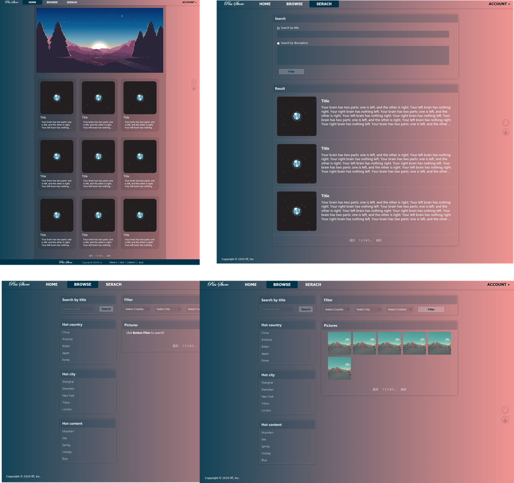
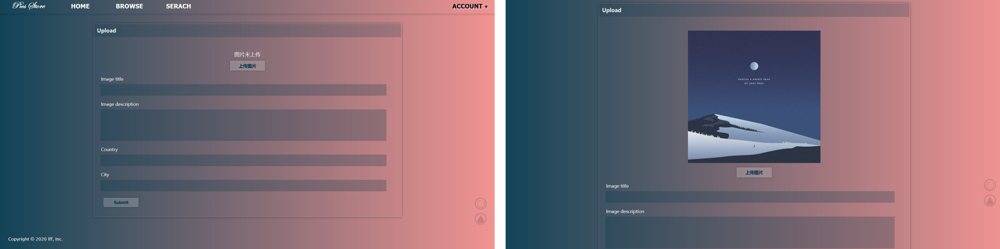
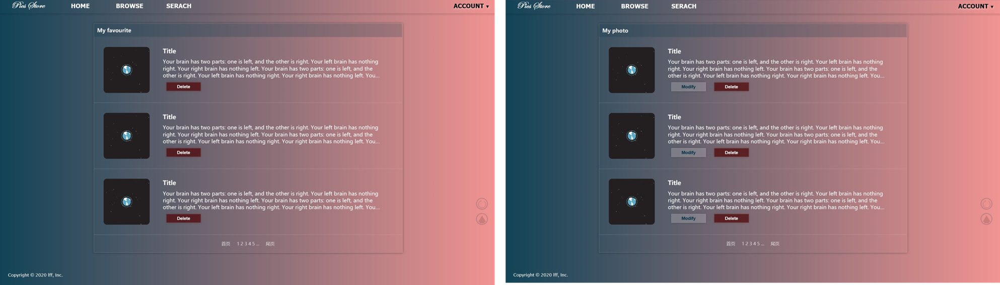
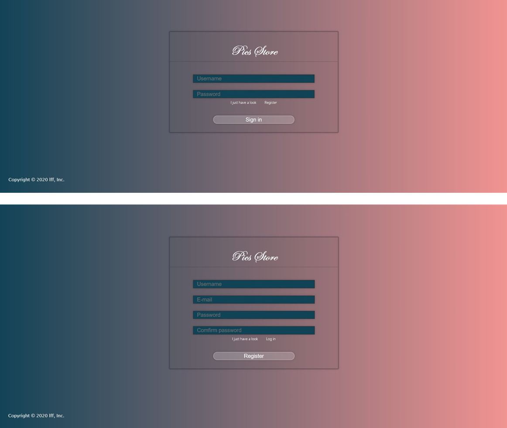
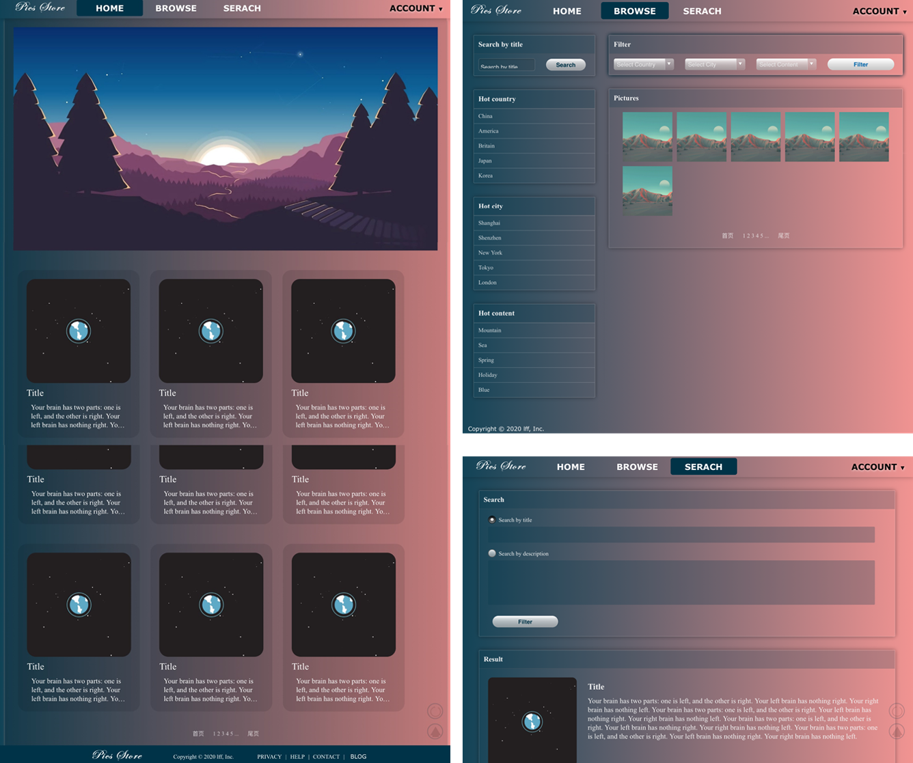
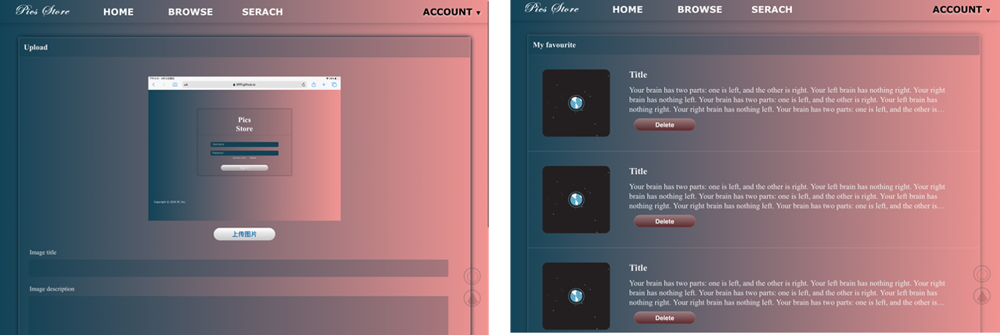
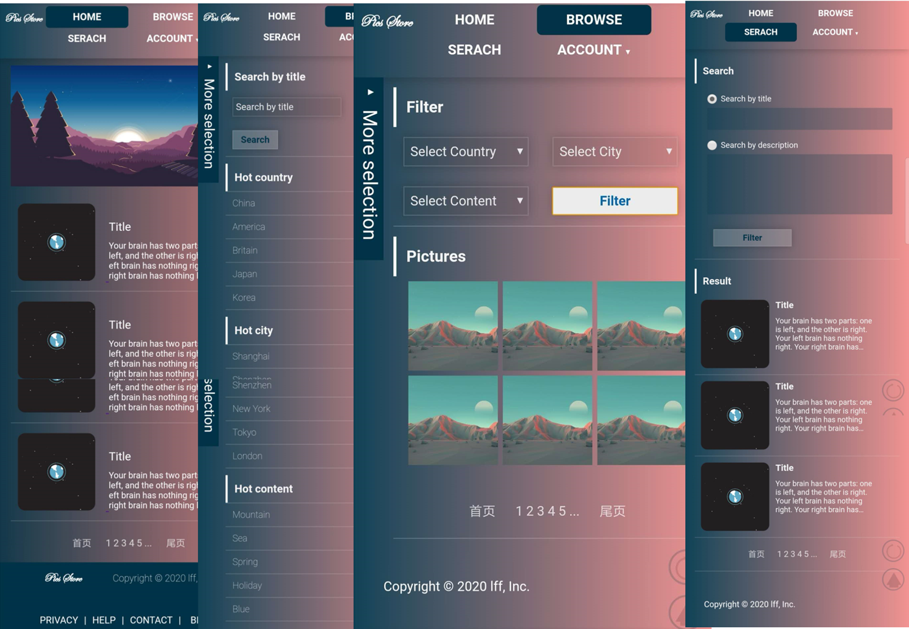
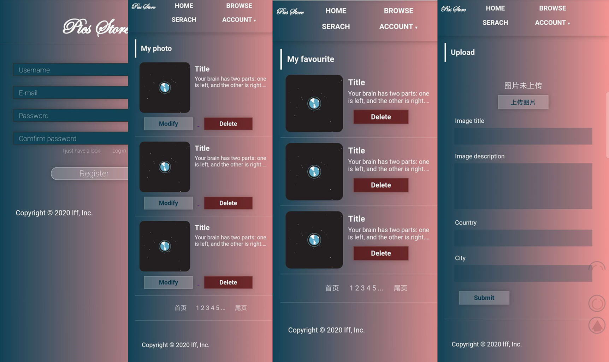

PJ1 说明文档
==========

姓名：李菲菲

学号：18307110500

Github 地址： <https://github.com/llffff/Web-Project1/>

静态网页地址： <https://llffff.github.io/Web-Project1/>

项目完成情况：已完成grade.pdf上内容

Bonus完成情况：已完成5.1，5.2，5.3

-------------------

## 对本课程的建议

1. 可以提供一些书面练习题和作业，类似期末考试会考的形式；
2. 希望能够拜读一些lab做的很好的同学的代码 : )

------

## Bonus 相关

### Bonus 解决方法

#### B5.1 图片处理

图片容器为div；
设置其background-image为图片，设置norepeat和cover；
可通过设置div的height和width调整显示为正方形。

#### B5.2 响应式布局

1. 在html文档中，添加
    `<meta name="viewport" content="width=device-width, initial-scale=1, maximum-scale=1, user-scalable=no">`

2. 在CSS中，使用
`@media screen and (min-width: xxxpx) and (max-width: xxxpx) {}`
对选择器进行分类；对不同屏幕宽度的设备进行css样式区分

    > width大于900px，为laptop或PC端；
    width介于600px和900px，为pad或手机横屏；widh小于600px，为手机竖屏；

3. 部分元素的宽高使用百分比设置，以适应不同宽度；

-------------------

#### 页面截图
(截图已上传prt_sc文件夹)

#### 1.**laptop**

    [laptop-sample1] 主页、浏览、搜索 ↓
> 

    [laptop-sample2] 上传、我的图片、我的收藏 ↓
> 

> 

    [laptop-sample3] 注册、登录 ↓
> 

-------------------

 #### 2.**pad/手机横屏**

    [pad-sample1] 主页、浏览、搜索 ↓
> 

    [pad-sample2] 个人中心 ↓
> 

-------------------

#### 3.**手机竖屏**

    [phone-sample1] 主页、浏览、搜索 ↓
> 

    [phone-sample2] 个人中心、注册 ↓
> 
